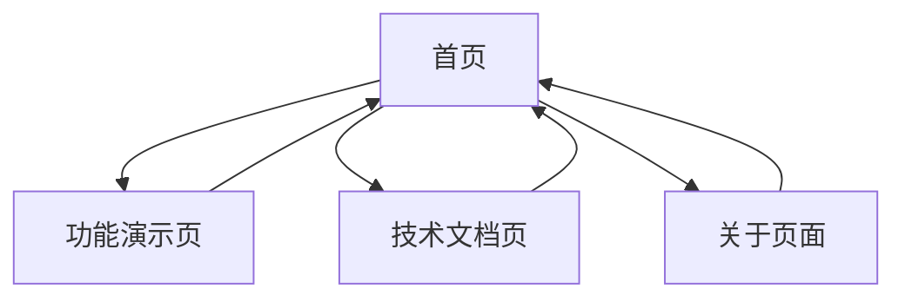

## 1. Product Overview
科技感十足的项目首页，展示项目核心功能和技术特色，为用户提供现代化、专业的第一印象。
- 主要目的：展示项目技术实力，吸引用户关注，提供清晰的导航入口
- 目标用户：开发者、技术决策者、潜在用户
- 市场价值：提升项目专业形象，增强用户信任度和参与度

## 2. Core Features

### 2.1 Feature Module
我们的科技感首页包含以下核心页面：
1. **首页**：英雄区域、功能展示、技术栈介绍、快速开始
2. **功能演示页**：交互式功能展示、实时数据可视化
3. **技术文档页**：API文档、使用指南、技术架构
4. **关于页面**：项目介绍、团队信息、联系方式

### 2.2 Page Details

| Page Name | Module Name | Feature description |
|-----------|-------------|---------------------|
| 首页 | 英雄区域 | 动态背景效果、项目标题动画、核心价值展示 |
| 首页 | 功能展示 | 卡片式功能介绍、悬停动效、图标动画 |
| 首页 | 技术栈 | 技术标签云、进度条动画、技能雷达图 |
| 首页 | 快速开始 | 代码示例展示、一键复制、安装指南 |
| 功能演示页 | 实时监控 | 数据图表、实时更新、交互式控制面板 |
| 功能演示页 | API测试 | 在线API调试、请求响应展示、参数配置 |
| 技术文档页 | 文档导航 | 侧边栏导航、搜索功能、章节跳转 |
| 技术文档页 | 内容展示 | 代码高亮、复制功能、示例运行 |
| 关于页面 | 项目信息 | 项目历程、版本更新、开源协议 |
| 关于页面 | 团队展示 | 成员介绍、联系方式、社交链接 |

## 3. Core Process
用户访问首页后，可以通过英雄区域了解项目核心价值，浏览功能展示区域了解具体功能，查看技术栈了解技术实力，通过快速开始区域获取使用指南。用户可以进入功能演示页面体验实际功能，访问技术文档页面获取详细文档，或者查看关于页面了解项目背景。

## 4. User Interface Design
### 4.1 Design Style
- **主色调**：深蓝色 (#0a0e27)、科技蓝 (#00d4ff)、渐变紫 (#6366f1)
- **辅助色**：白色 (#ffffff)、浅灰 (#f8fafc)、深灰 (#1e293b)
- **按钮样式**：圆角渐变按钮，悬停发光效果
- **字体**：主标题使用 Inter Bold，正文使用 Inter Regular，代码使用 JetBrains Mono
- **布局风格**：现代卡片式布局，网格系统，响应式设计
- **图标风格**：线性图标配合发光效果，科技感几何图形
- **动画效果**：粒子背景、打字机效果、渐入动画、悬停变换

### 4.2 Page Design Overview

| Page Name | Module Name | UI Elements |
|-----------|-------------|-------------|
| 首页 | 英雄区域 | 全屏渐变背景、粒子动效、大标题打字机动画、CTA按钮发光效果 |
| 首页 | 功能展示 | 3D卡片布局、悬停翻转效果、图标动画、渐变边框 |
| 首页 | 技术栈 | 六边形网格布局、技能进度条、雷达图可视化、标签云动画 |
| 首页 | 快速开始 | 代码块语法高亮、复制按钮动效、步骤指示器、终端模拟器风格 |
| 功能演示页 | 实时监控 | 仪表盘布局、图表动画、数据流效果、控制面板 |
| 技术文档页 | 文档导航 | 侧边栏滑动效果、搜索框聚焦动画、面包屑导航 |
| 关于页面 | 团队展示 | 头像悬停效果、社交图标动画、时间轴布局 |

### 4.3 Responsiveness
采用移动优先的响应式设计，支持桌面端、平板和手机端适配，优化触摸交互体验。