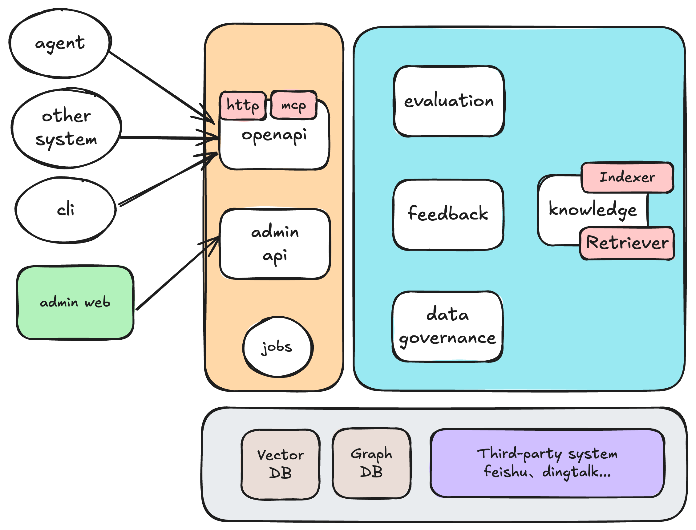
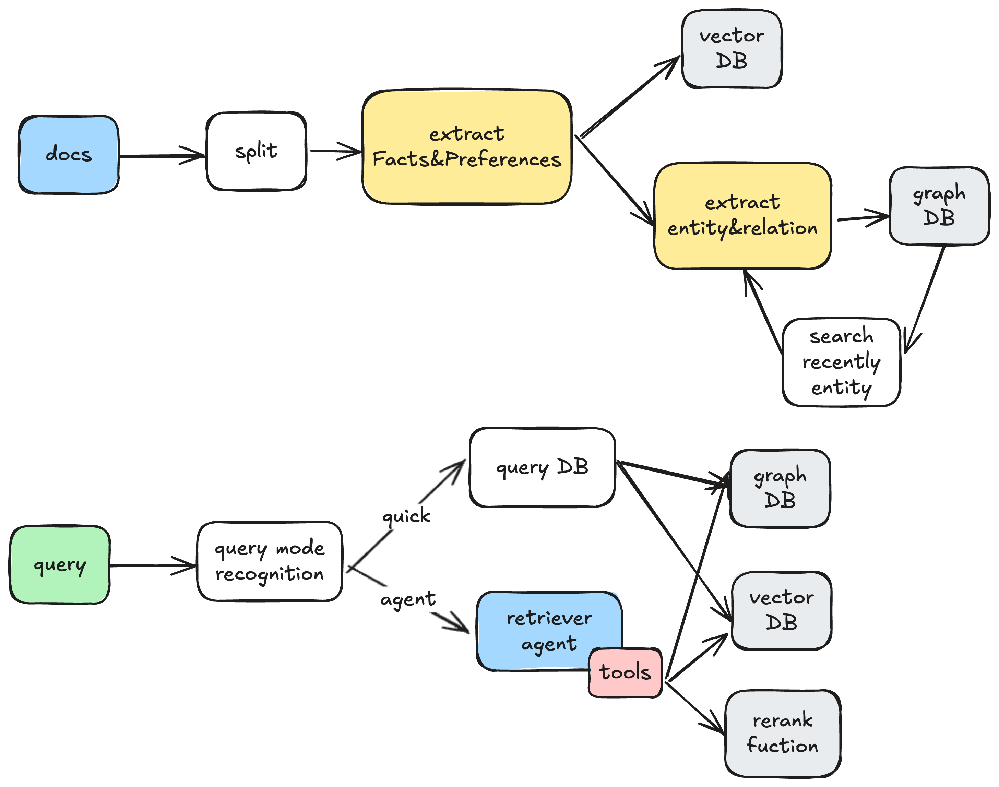

[](https://github.com/xyzbit/ino/blob/master/LICENSE)
[](https://github.com/xyzbit/ino/issues)
[](https://github.com/xyzbit/ino/issues?q=is%3Aissue%20state%3Aclosed)


English | [中文](README_ZH.md)

## OverView
Currently, large model applications face issues such as the lack of long-term memory, insufficient business knowledge, and lack of real-time performance. The essence of these problems lies in the large models' inability to independently acquire and record certain types of knowledge, such as:
- Enterprise private knowledge
- Memory data, such as user behaviors, feedback, preferences...

These can be collectively referred to as "knowledge". Currently, there are solutions like RAG and Memory System to supplement various types of knowledge, but their integration is complex and involves a lot of repetitive work.

To address these issues, **`ino[i know]`** was born. It is a Unified Retrieval Framework.

The core idea of this system is: to regard all information sources that may be helpful to LLM (such as external documents, conversation history, user portraits, etc.) as retrievable `knowledge`, and establish a unified system to intelligently extract, retrieve, screen, and integrate this knowledge, and finally inject it into the `Prompt` in an optimized way.

The functions of **`ino`** include but are not limited to:
- Vector database and graph database indexing
- Quick retrieval of relevant data, and in-depth retrieval of relevant data by agent
- Quality evaluation module, which is used to evaluate the recall quality of the current system and output multi-dimensional evaluation reports
- Feedback collection module, which is used to collect user feedback to continuously optimize recall quality and output changes in the like and dislike rates
- Data quality governance, which automatically and manually solves outdated, conflicting, and redundant data
- Multiple access methods such as mcp and visual cli

## Architecture


### Core Processes
**Indexing process**: After extracting factual and preference information from the request content, vector storage, as well as graph construction and graph storage are performed.

**Recall process**: It distinguishes between quick mode and agent mode. The quick mode is suitable for scenarios with requirements on return delay, while the agent mode provides more in-depth recall.




## QuickStart

### Writing Knowledge

Use the `POST /api/v1/openapi/collect` endpoint to write knowledge.

**Request Example**
```bash
curl --location 'http://localhost:8080/api/v1/openapi/collect' \
--header 'user-key: <YOUR_USER_KEY>' \
--header 'Content-Type: application/json' \
--data '{
    "content": "The quick brown fox jumps over the lazy dog."
}'
```
Or write knowledge via a link:
```bash
curl --location 'http://localhost:8080/api/v1/openapi/collect' \
--header 'user-key: <YOUR_USER_KEY>' \
--header 'Content-Type: application/json' \
--data '{
    "content_link": "https://en.wikipedia.org/wiki/Fox"
}'
```

**Parameters**
- `user-key`: (Header) Optional, identifies the user.
- `collection-key`: (Header) Optional, identifies the collection.
- `content`: (Body) Knowledge content. Either `content` or `content_link` is required.
- `content_link`: (Body) Link to knowledge content.


### Reading Knowledge

Use the `POST /api/v1/openapi/search` endpoint to retrieve knowledge.

**Request Example**
```bash
curl --location 'http://localhost:8080/api/v1/openapi/search' \
--header 'user-key: <YOUR_USER_KEY>' \
--header 'Content-Type: application/json' \
--data '{
    "query": "What does the fox say?"
}'
```

**Parameters**
- `user-key`: (Header) Optional, filters by user.
- `collection-key`: (Header) Optional, filters by collection.
- `query`: (Body) Required, the query question.
- `query_strategy`: (Body) Optional, query strategy: `quick` (default) or `agent`.

## Development Guide
> Note: Docker installation is required

### Start Dependent Services
```bash
make services-up
```

### Run ino
```bash
make dev
```

## RoadMap
[RoadMap](docs/RoadMap.md)

> more docs your can see in `./docs`