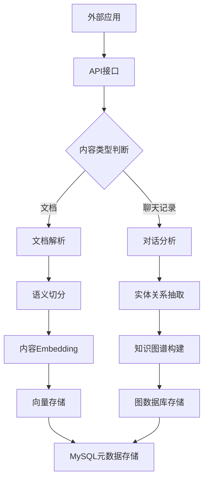
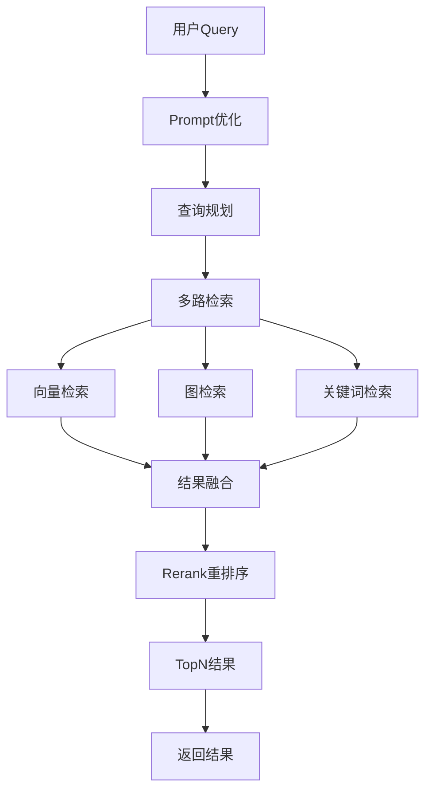

# ino 知识增强系统详细技术文档

## 1. 系统概述

### 1.1 背景
ino 知识增强系统是一个统一检索框架，旨在解决大模型在长期记忆、业务知识、实时性等方面的不足。系统将所有可能对LLM有帮助的信息源（外部文档、对话历史、用户画像等）视为可检索的"知识"，通过智能检索、筛选、整合这些知识，最终以最优化的方式注入到Prompt中。

### 1.2 核心价值
- **统一接入**：提供统一的知识接入和检索框架
- **智能检索**：融合向量检索、图检索、关键词检索等多种检索方式
- **记忆增强**：为大模型提供持久化的记忆能力
- **效果评估**：提供完整的系统优化评估机制

## 2. 技术选型

### 2.1 核心框架
- **Web框架**：Gin（Go语言高性能Web框架）
- **AI框架**：Eino（统一的AI应用开发框架）
- **编程语言**：Go 1.21+

### 2.2 数据库选型
- **关系型数据库**：MySQL 8.0+
  - 存储结构化数据、用户信息、反馈数据
  - 支持事务、索引优化
  - 适合统计分析和报表生成
  
- **向量数据库**：Milvus 2.3+
  - 存储embedding向量
  - 支持高效的向量相似度检索
  - 支持多种向量距离计算方式
  
- **图数据库**：Neo4j 5.0+
  - 存储实体关系图谱
  - 支持复杂的图查询和路径分析
  - 适合知识图谱的存储和查询

## 3. 系统架构

### 3.1 整体架构
```
┌─────────────────┐    ┌─────────────────┐    ┌─────────────────┐
│   外部应用       │    │   ino系统        │    │   AI            │
│                 │    │                 │    │                 │
│ ┌─────────────┐ │    │ ┌─────────────┐ │    │ ┌─────────────┐ │
│ │   SDK/API   │ │◄──►│ │  知识收集    │ │    │ │    LLM      │ │
│ └─────────────┘ │    │ └─────────────┘ │    │ └─────────────┘ │
│                 │    │ ┌─────────────┐ │    │                 │
│                 │    │ │  知识查询    │  │◄──►│                  │
│                 │    │ └─────────────┘ │    │                 │
└─────────────────┘    └─────────────────┘    └─────────────────┘
                                │
                                ▼
                       ┌─────────────────┐
                       │   存储层        │
                       │                 │
                       │ ┌─────────────┐ │
                       │ │   MySQL     │ │
                       │ └─────────────┘ │
                       │ ┌─────────────┐ │
                       │ │   Milvus    │ │
                       │ └─────────────┘ │
                       │ ┌─────────────┐ │
                       │ │   Neo4j     │ │
                       │ └─────────────┘ │
                       └─────────────────┘
```

### 3.2 服务模块划分
- **API Gateway**：统一入口，负责路由、认证、限流
- **Knowledge Collector**：知识收集服务
- **Knowledge Retriever**：知识查询服务
- **FeedBack Manager**：反馈收集服务
- **Evaluation Service**：效果评估服务

## 4. 核心流程设计

### 4.1 知识收集流程


### 4.2 知识查询流程
